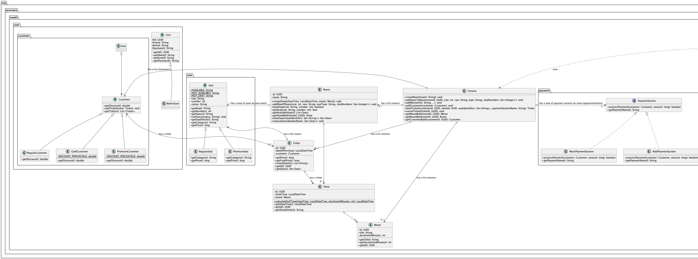

# Demostración de Herencia, Interfaces y Polimorfismo en Java

## Propósito

Este repositorio tiene como objetivo principal ilustrar los conceptos fundamentales de la Programación Orientada a Objetos (POO) como la **Herencia**, las **Interfaces** y el **Polimorfismo** a través de un sistema de gestión de cine simplificado implementado en Java.

## Conceptos Clave Demostrados

### 1. Herencia

La herencia permite que una clase (subclase o clase derivada) adquiera propiedades y métodos de otra clase (superclase o clase base). Esto promueve la reutilización de código y establece una jerarquía natural entre las clases.

**Ejemplos en el proyecto:**

*   La clase abstracta `User` es la clase base para `Customer` y `AdminUser`.
    *   `Customer` hereda atributos como `id`, `name`, `email`, `password` de `User`.
*   La clase abstracta `Customer` es la clase base para `RegularCustomer`, `GoldCustomer`, y `PremiumCustomer`.
    *   Cada tipo de cliente hereda la funcionalidad base de `Customer` y puede especializarla (por ejemplo, el método `getDiscount()`).
*   La clase abstracta `Seat` es la clase base para `RegularSeat` y `PremiumSeat`.
    *   Ambos tipos de asientos heredan propiedades como `row`, `number`, `status` y métodos comunes, pero implementan `getPrice()` y `getCategory()` de forma específica.

### 2. Interfaces

Una interfaz en Java es un tipo de referencia, similar a una clase, que solo puede contener constantes, firmas de métodos, métodos default, métodos estáticos y tipos anidados. Los cuerpos de los métodos solo existen para los métodos default y estáticos. Las interfaces especifican un contrato que las clases pueden implementar.

**Ejemplos en el proyecto:**

*   La interfaz `PaymentSystem` define un contrato para los sistemas de pago.
    *   Debe tener un método `processPayment(Customer customer, long amount)` y `getPaymentName()`.
    *   Clases como `MockPaymentSystem` y `AddiPaymentSystem` implementan esta interfaz, proporcionando sus propias lógicas para procesar pagos pero adhiriéndose al contrato definido. Esto permite que la clase `Cinema` trabaje con cualquier sistema de pago que implemente `PaymentSystem` sin conocer los detalles específicos de cada uno.

### 3. Polimorfismo

El polimorfismo (del griego "muchas formas") permite que objetos de diferentes clases sean tratados como objetos de una superclase común: 

*   **Polimorfismo de Sobrescritura (Runtime Polymorphism):** Ocurre cuando una subclase proporciona una implementación específica de un método que ya está definido en su superclase.

**Ejemplos en el proyecto:**

*   **Sobrescritura de `getDiscount()`:**
    *   La clase `Customer` declara el método abstracto `getDiscount()`.
    *   Las subclases `RegularCustomer`, `GoldCustomer`, y `PremiumCustomer` sobrescriben este método para proporcionar el porcentaje de descuento específico para cada tipo de cliente.
    *   Cuando se llama a `customer.getDiscount()`, la versión correcta del método se ejecuta dependiendo del tipo real del objeto `customer` en tiempo de ejecución.
*   **Sobrescritura de `getPrice()` y `getCategory()` en `Seat`:**
    *   La clase `Seat` declara estos métodos como abstractos.
    *   `RegularSeat` y `PremiumSeat` los sobrescriben para devolver el precio y la categoría correspondientes.
*   **Uso de `PaymentSystem`:**
    *   La clase `Cinema` tiene una referencia de tipo `PaymentSystem`. Esta referencia puede apuntar a un objeto `MockPaymentSystem` o `AddiPaymentSystem`.
    *   Cuando se llama a `paymentSystem.processPayment(...)`, el método específico de la clase del objeto actual (`MockPaymentSystem` o `AddiPaymentSystem`) es invocado.

## Estructura del Proyecto

El proyecto simula un sistema básico de cine, incluyendo:

*   **Usuarios (`org.javeriana.model.user`):**
    *   `User`: Clase base abstracta para todos los usuarios.
    *   `AdminUser`: Representa a un usuario administrador.
    *   `Customer`: Clase base abstracta para clientes.
        *   `RegularCustomer`: Cliente sin descuento.
        *   `GoldCustomer`: Cliente con un 10% de descuento.
        *   `PremiumCustomer`: Cliente con un 20% de descuento (asumiendo que esta clase existe o se añadiría siguiendo el patrón).
*   **Asientos (`org.javeriana.model.seat`):**
    *   `Seat`: Clase base abstracta para los asientos.
    *   `RegularSeat`: Asiento de categoría regular.
    *   `PremiumSeat`: Asiento de categoría premium.
*   **Pagos (`org.javeriana.model.payment`):**
    *   `PaymentSystem`: Interfaz que define el contrato para los sistemas de pago.
    *   `MockPaymentSystem`: Implementación simulada de un sistema de pago.
    *   `AddiPaymentSystem`: Otra implementación de un sistema de pago.
*   **Componentes del Cine (`org.javeriana.model`):**
    *   `Cinema`: Clase principal que gestiona salas, películas, clientes y reservas.
    *   `Room`: Representa una sala de cine con sus asientos y funciones programadas.
    *   `Movie`: Representa una película.
    *   `Show`: Representa una función específica de una película en una sala y horario.
    *   `Ticket`: Representa un tiquete comprado por un cliente para una función.

## Ejecución

La clase `org.javeriana.Main` contiene un ejemplo de cómo se pueden utilizar las diferentes clases para:
1. Crear un cine con diferentes sistemas de pago.
2. Añadir salas y configurar sus asientos.
3. Añadir películas.
4. Programar funciones.
5. Registrar diferentes tipos de clientes.
6. Realizar reservas de tiquetes para diferentes clientes, demostrando cómo se aplican los descuentos polimórficamente.
7. Cancelar tiquetes.

## Diagrama de Clases

